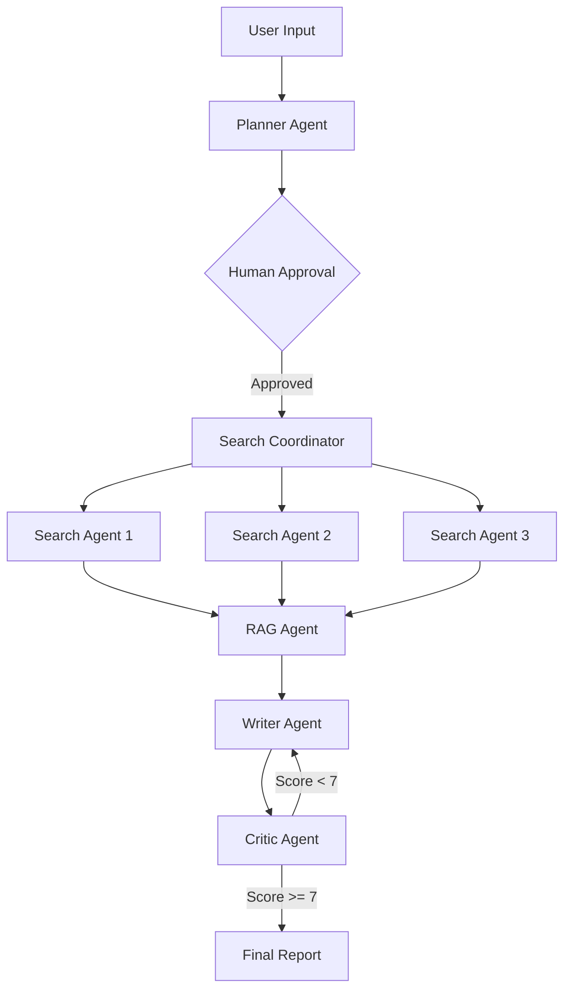

# 🔬 DeepResearch AI

    

Research Anything. In Minutes. 5 specialized LangGraph AI agents collaborate to deliver publishable research reports with live SSE streaming.

[Live Demo](https://deepresearch-ai.vercel.app)

## What It Does
DeepResearch AI breaks down complex topics, distributes parallel web searches to worker agents, optionally extracts context via RAG, synthesizes the information into a cohesive report, and loops through an automated critic revision layer to ensure high-quality citations and structural perfection. 

## Agent Architecture


## Key Technical Highlights
- **LangGraph Parallel Execution**: Uses LangGraph's dynamic `Send()` API to conditionally spawn multiple search workers simultaneously.
- **Real-time SSE Streaming**: Pub/sub architecture with Redis streaming execution status per agent down to the UI token-by-token.
- **Human-in-the-Loop**: Checkpointing state graphs mapping human approval seamlessly to resume computation.

## Tech Stack
| Category | Technology | Purpose |
|----------|------------|---------|
| Frontend | Next.js 14 | UI, Routing |
| Backend | FastAPI | API server, Server-Sent Events |
| Agent Framework | LangGraph / LangChain | Multi-agent orchestration |
| Observability | LangSmith | Token and chain tracing |
| Vector DB | Pinecone | User document embeddings |
| Primary Database| PostgreSQL (Supabase) | Sessions, Users, State |
| Queue / PubSub | Celery / Redis | Background processing & SSE broadcast |
| Auth & Payments | Clerk / Stripe | User authentication & SaaS Credit Monetzation |

## Getting Started

1. Set up your `.env` files in both frontend and backend using `.env.example`.
2. Start the local stack using Docker:
   ```bash
   cd backend
   docker-compose up -d
   ```
3. Run Alembic migrations to setup the Postgres DB:
   ```bash
   alembic upgrade head
   ```
4. Start the frontend:
   ```bash
   cd frontend
   npm run dev
   ```

## Features
- ✅ Multi-agent LangGraph pipeline
- ✅ Real-time SSE agent streaming 
- ✅ Human-in-the-loop plan approval
- ✅ RAG with user document upload
- ✅ Credit-based SaaS with Stripe
- ✅ PDF export
- ✅ Public report sharing
- ✅ LangSmith observability

## Contributing
Pull requests welcome!
